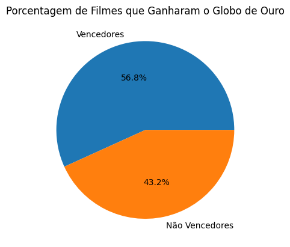
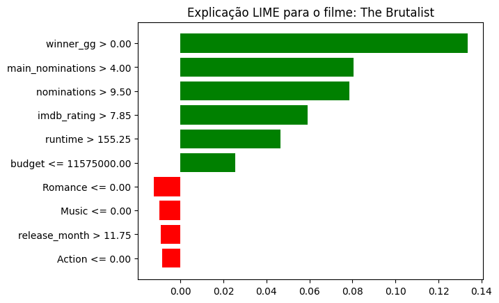

# Previsão de Vencedores do Oscar de Melhor Filme de 2025

Esse trabalho visa desenvolver um modelo de classificação para prever o vencedor da categoria de Melhor Filme do Oscar, com base em informações dos filmes indicados. Para isso, o modelo é alimentado com os 10 indicados na categoria em uma edição determinada, com informações específicas de cada um, e devolve como saída a probabilidade calculada de cada um dos longas ser o vencedor.

## Estrutura do Projeto
- `modelagem.ipynb`: Notebook para visualização dos dados, extração de informações e treinamento do modelo em Python;
- `modelo.pkl`: Modelo final treinado com RandomForestClassifier, em formato Pickle;
- `codigo.py`: Código para previsão de filmes dada qualquer lista de filmes inclusos em input.

Para utilização do projeto localmente, é necessário o download apenas do `modelo.pkl` e o `codigo.py`, rodando o arquivo Python em um ambiente de desenvolvimento integrado na máquina e preenchendo informações requisitadas para os filmes a serem previstos. O código retornará a lista dos 10 filmes, em ordem, com suas probabilidades de vitória calculadas com base na previsão feita.

## Processo de modelagem

### Dados utilizados

"Para este projeto, foi construída uma base de dados própria, combinando informações de filmes de diversos bancos de dados públicos disponíveis na internet. Elas foram as seguintes:
- `TMDB_movie_dataset_v11.csv` (The Movie DataBase): Contém dados de todos os filmes registrados na história do cinema. Dessa base, foram retiradas a maior parte das informações utilizadas para treinamento do modelo, como gêneros do filme, duração, orçamento e bilheteria, entre outros
- `golden_globe_awards.csv` (Premiação Globo de Ouro): Representa informações sobre a segunda maior premiação americana de cinema, o Globo de Ouro. Desses, foi utilizado somente uma variável binária que indica vitória ou não na categoria principal do globo de ouro, que tende a ter correlação alta com o Oscar, sempre ocorrendo anteriormente ao mesmo
- `the_oscar_award.csv` (Premiação Oscar): Base com histórico de todos os Oscars anteriores. Foi usada para criação da variável resposta do modelo, mas também para outras variáveis dependentes (como número de indicações totais)
- `title.ratings.tsv.gz` (IMDb): Contém informações de filmes no maior site de avaliação de cinema da internet, o IMDb (Internet Movie Database). Foi utilizada para as variáveis de popularidade e recepção (número de avaliações e nota média das mesmas no site)

Para agrupamento de tais bases, foram utilizadas como pilares as colunas indicativas de nome e ano de lançamento dos filmes, apesar de que, em alguns casos, certas divergências de caligrafia e tradução de nomes tiveram que ser contornados por meios alternativos. Dentre eles, foi utilizada uma técnica de processamento da biblioteca fuzzywuzzy, na qual títulos de certa base tiveram que ser comparados com todos os títulos da base maior (TMDb) para se encontrar os dados matematicamente mais próximos em caligrafia, a fim de se encontrar seus "pares" na outra lista.

### Exploração dos dados

Para análise de variáveis mais importantes para realização da previsão, foram desenvolvidas visualizações que poderiam indicar relações entre a vitória de um filme no Oscar e seus outros fatores:

Em primeira análise, nota-se que mais de 56% dos vencedores do Oscar também foram vencedores do Globo de Ouro, o que pode indicar esse como um fator determinante para se prever a variável resposta.

Para todas essas análises, o resultado é similar, mudando apenas em proporção em cada um deles: a média dos valores em filmes vencedores do Oscar (representados pela linha verde) são maiores em comparação a filmes não vencedores (linha vermelha). Isso é especialmente perceptível nas categorias de indicações (em que a média é 9 para vencedores e 6 para outros indicados) e popularidade, em que o número de avaliações médio é mais do que o dobro para filmes vencedores.

Por outro lado, apesar de ainda ter uma vantagem, a diferença média de notas é menor comparativamente, o que contradiz a intuição de que os vencedores do prêmio são sempre os filmes mais aclamados.

### Modelo

Como citado anteriormente, foi utilizado o modelo de Floresta Aleatória da biblioteca sklearn (RandomForestClassifier). Para o treinamento, foram separados os filmes da base pelos anos de cerimônia dos quais eles participaram, de forma que todos os filmes do mesmo ano ficassem juntos no treinamento e no teste. A separação foi feita de forma que 77 cerimônias foram selecionadas para o treino, e as outras 19 ficaram para testes (80/20); dessas 19 usadas no teste, foi determinado o escolhido como "vencedor previsto" o filme com maior probabilidade calculada dentre os indicados, independente de seu valor absoluto. Para avaliação da eficácia do modelo, a métrica escolhida foi o recall, visto que, devido ao método alternativo de seleção das previsões do modelo, era necessária a utilização de uma métrica que avaliasse somente os casos positivos (vencedores). Dessa forma, os resultados desse teste foram o seguinte:

- Recall: **66.67%** (vencedor certo foi o vencedor previsto em 66.67% dos casos)
- Top-2 Recall: **77.78%** (vencedor certo era um dos dois mais prováveis previstos em 77.78% dos casos)

Já a matriz de confusão, que ilustra o desempenho do modelo nas previsões, ficou dessa forma:

A matriz de confusão mostra os acertos e erros do modelo, classificando-os em quatro categorias: Verdadeiro Positivo (VP), Falso Positivo (FP), Verdadeiro Negativo (VN) e Falso Negativo (FN). Ela permite avaliar, por exemplo, quantos vencedores foram corretamente identificados (VP), e quantos filmes não vencedores foram incorretamente escolhidos como vencedores (FP).

### Limitações

Apesar de não ser um modelo perfeito, concluiu-se que um aprimoramento em seu desempenho apenas com dados disponíveis ao público seria demasiadamente complexo, considerando as diversas nuances subjetivas e informações confidenciais que acabam se passando durante uma votação de prêmios como o Oscar. Muitas vezes, fatores como campanhas de marketing, a percepção pública e até a influência de fatores não técnicos podem afetar a escolha do vencedor, o que é difícil de capturar em variáveis objetivas como orçamento ou popularidade. Um exemplo disso são os casos em que o modelo não previu corretamente o vencedor entre os dois filmes mais prováveis, sendo casos em que o vencedor da categoria naquele ano foi considerada uma grande surpresa mesmo entre especialistas de cinema (como por exemplo o ano de 2006, com o vencedor sendo o divisivo filme Crash - No Limite).

Além disso, as próprias variáveis utilizadas no treinamento do modelo podem apresentar pequenos problemas que podem limitar sua capacidade de prever com precisão as dinâmicas do mundo cinematográfico. Um exemplo disso é o indicador de popularidade, que pode estar distorcido para essa análise, visto que a popularidade de um filme no IMDb tem a tendência de aumentar bastante caso o filme seja o vencedor do Oscar, criando um viés nos dados históricos e prejudicando o modelo para futuras previsões.

Outras variáveis, como bilheteira e lucro, podem ser imprecisas ou menos representativas, especialmente com o crescente domínio de plataformas de streaming (Netflix, Disney+, entre outras), que não divulgam dados financeiros da mesma forma que cinemas tradicionais; as métricas de popularidade dos filmes dessas plataformas geralmente não são públicos, dificultando tais análises para cerimônias recentes do Oscar. Um exemplo desse fenômeno foi com o vencedor de melhor filme do Oscar 2022, "CODA - No Ritmo do Coração", que é um lançamento original da plataforma de streaming da Apple, que tendo gerado um prejuízo teórico de acordo com os cálculos na base, foi um filme provavelmente de grande popularidade no mundo digital, mas com um desempenho comercial distorcido devido à sua natureza de distribuição online.

Apesar dessas limitações, o modelo tem um desempenho satisfatório para previsões, especialmente considerando as dificuldades em obter dados de premiações como o Oscar, que são fortemente influenciados por fatores subjetivos. No entanto, é importante notar que o modelo pode não ser totalmente preciso em situações imprevisíveis, como surpresas nas escolhas dos vencedores, que frequentemente ocorrem em premiações dessa natureza.

## Previsão do Oscar 2025

Ao final da validação do modelo, este foi utilizado para previsão do Oscar 2025, visto que os indicados já haviam sido indicados ao momento da finalização do projeto, sem definição do vencedor. Preenchidas as informações, os resultados foram os seguintes:

| Posição | Filme               | Probabilidade |
|--------|---------------------|---------------|
| **1**  | **The Brutalist**    | **28.97%**    |
| **2**  | **Emilia Pérez**     | **15.93%**    |
| 3      | Ainda Estou Aqui     | 10.77%        |
| 4      | Dune: Part Two       | 9.59%         |
| 5      | Wicked               | 9.24%         |
| 6      | A Complete Unknown   | 7.92%         |
| 7      | Anora                | 6.68%         |
| 8      | Conclave             | 4.76%         |
| 9      | The Substance        | 3.75%         |
| 10     | Nickel Boys          | 2.40%         |

De acordo com os resultados, espera-se que o vencedor do Oscar 2025 seja um dos filmes 'The Brutalist' ou 'Emilia Pérez', com uma maior chance para o primeiro. Para elaboração dos motivos do favoritismo de tais filmes, desenvolveu-se um explicador LIME (Local Interpretable Model-Agnostic Explanations), utilizado para explicar as principais variáveis responsáveis pela previsão dos filmes favoritos para o Oscar. Seus resultados se encontram a seguir:

Com base nessa avaliação, é possível se concluir o principal fator para se definir o favorito ao prêmio do oscar: a variável de vitória no globo de ouro é determinante para que Emilia Pérez esteja a frente do filme Ainda Estou Aqui, por exemplo. Depois dessa categoria principal, entram outros aspectos, como número de indicações totais e em categorias principais, lucro / orçamento dos filmes e duração. Comparando os dois favoritos, alguns dos fatores que colocaram The Brutalist como o favorito isolado são: sua nota média alta (acima de 7.85) e sua duração maior, além do fator de que Emilia Pérez gerou prejuízo para sua distribuidora nos cinemas considerando o cálculo de lucro.

## Contato
- [Meu LinkedIn](https://www.linkedin.com/in/carlos-neto-5668b0265/)
- Email: carloshmneto@usp.br
